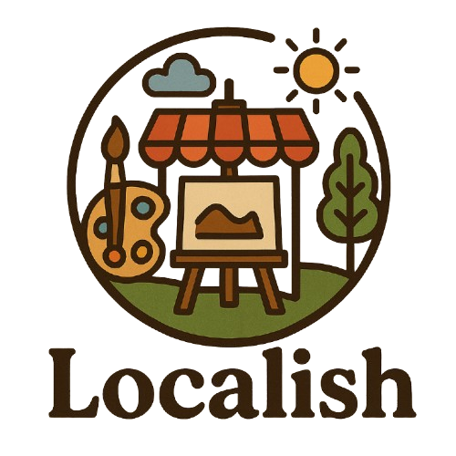

<p align="center">
  
</p>

<h1 align="center">Localish: The Local Artisan Marketplace</h1>

<p align="center">
  <a href="https://codecov.io/gh/uno791/local-artisan-marketplace">
    
  </a>
</p>


Welcome to **Localish**, a community-driven-online marketplace.

---

## Submission Links

| Artifact                  | Link                                                                                                                                   |
|---------------------------|----------------------------------------------------------------------------------------------------------------------------------------|
| Project Documentation (PDF) | [Download Project Documentation](client/src/assets/DOC.pdf)                                                                            |
| Demo Video             | [Watch Project Walkthrough](https://youtu.be/your-demo-video-id)                                                                       |
| Live Application       | [https://calm-meadow-0fbb07c03.6.azurestaticapps.net](https://calm-meadow-0fbb07c03.6.azurestaticapps.net/)                           |
| GitHub Repository      | [GitHub – uno791/local-artisan-marketplace](https://github.com/uno791/local-artisan-marketplace)                                       |


## Local Setup
### Client
```bash
cd client
npm install
npm run dev
```

### Server
```bash
cd server
npm install
node app.js
```


